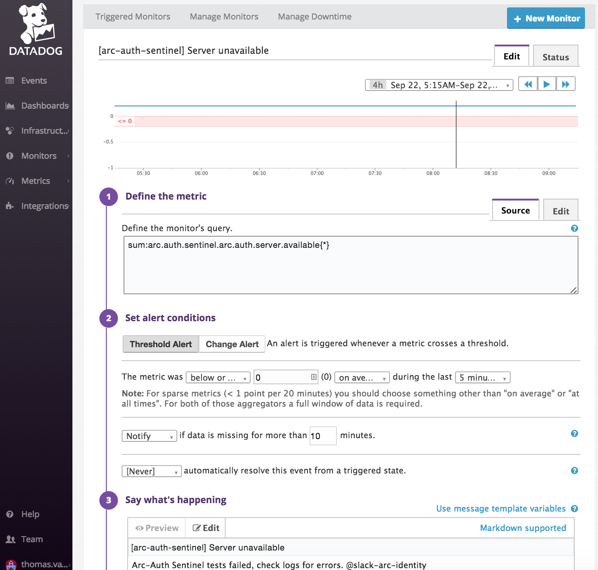

# dropwizard-liveness-reporter
Simple thread to squawk a "1" against a Statsd gauge to act as a sentinel for uptime monitors/alerts

## Use case
Dropwizard already has great Metrics support and provides out-of-the-box endpoints for testing the status and health of a Dropwizard service.  This small artifact is designed to support a pro-active "ping out" approach (e.g. "I'm still alive") as opposed to a reactive "ping in" approach (e.g. "Are you still alive")?

At The Washington Post, we run Dropwizard micro-services in Docker containers.  Each docker container is deployed to a server on which we can count on there being a Datadog Agent available at the UDP port "statsd:8125".  Metrics streams to that datadog agent are forwarded to our Datadog account where we can setup alerts to notify us over Slack or Email that the heartbeat that the LivenessReporter in this artifact hasn't been heard from in a while.  This screen shot demonstrates an example Monitor that looks for the absence of a heartbeat:



## Using this Artifact

### Including Dependency
In a Maven pom.xml, add:
```XML
        <dependency>
            <groupId>com.washingtonpost.dropwizard</groupId>
            <artifactId>dropwizard-liveness-reporter</artifactId>
            <version>1.4.0</version>  <!-- check RELEASE_NOTES.md for best version for you -->
        </dependency>
```

### Setting up Configuration
In your Dropwizard Configuration object add:
```Java
import com.washingtonpost.dropwizard.liveness.LivenessConfiguration;

public class MyConfiguration extends Configuration {
    @JsonProperty("liveness")
    private LivenessConfiguration liveness = new LivenessConfiguration();

    public LivenessConfiguration getLiveness() {
        return liveness;
    }

    public void setLiveness(LivenessConfiguration liveness) {
        this.liveness = liveness;
    }
```

In you application's configuration YAML, add:
```YAML
liveness:
    statsdHost: statsd              // required, server host name of your Datadog agent
    statsdPort: 8125                // defaults to 8125
    statsdPrefix: my.app.on.prod    // required, pick something that differentiates apps
    livenessMetric: server.alive    // required, this is the metric to Monitor
    livenessFrequencySec: 30        // defaults to 30
    tags: env:prod                  // for datadog categorization
```

### Running the LivenessReporter
The liveness reporter is a thread, which you start in your Dropwizard Application's run() method:
```Java
    @Override
    public void run(MyConfiguration configuration, Environment environment) throws Exception {
        configuration.getLiveness().buildAndRun();
    }
```

### Using a StatsDClient singleton
If your dropwizard application already has need of a StatsDClient, the LivenessConfiguration supports an additional builder option where you can pass in a previously constructed/provided StatsDClient:
```Java
    @Override
    public void run(MyConfiguration configuration, Environment environment) throws Exception {
        StatsDClient statsdClient = // get from some other configuration/environment option
        configuration.getLiveness().buildAndRun(statsdClient);
    }
```
